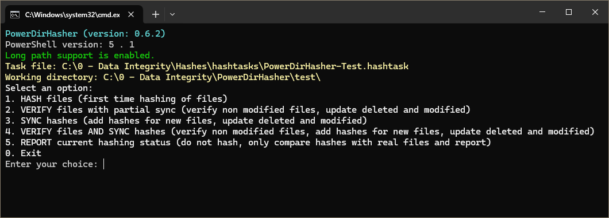

# PowerDirHasher

PowerDirHasher is a PowerShell script designed to do data integrity operations, using hash algorithms, for a folder or list of folders. It works under Windows 10/11.
It is designed to be super easy to use while still covering the most common features needed for file hashing and validation.
It does not only file hashing but also verification, file corruption detection (distinguishing between modified files and corrupted files) and keeps a full history of file changes for the target folder/s.

I provide this script as it is, with no plans to add more features or enhancements. This is just something I wanted for myself, since I couldn't find a hashing tool that would fit my needs, and I am happy to share it with anyone that finds it useful.

I am interested in bug reports, please open issues for those.



## USE AT YOUR OWN RISK

I believe this script pose no risks for your files and folders, or for your computer. But as a warning: USE IT AT YOUR OWN RISK. This is something that I have put together using the help of an AI model to convert my specifications into PowerShell code, and even if I reviewed the whole script and did some testing with my own files, I am not a PowerShell expert so I cannot say that I guarantee that this script won't have some undesired behavior that I could not think of.

This script has been tested only in a Windows 10 Pro 22H2 installation.

# Features

- It does not have a GUI but it provides a menu and clear output information so you know what it is being done at any time
- It takes as input a folder path but it can also take a text file containing a list of folders. So it can do batch processing of more than one folder.
- It will generate a single file containing the hashes for the input folder. If a list of folders is provided instead, it will generate a file per folder.
- It can hash a folder, verify a folder, synchronize the hashes (only check hashes for files that are added or modified and mark as deleted the hashes corresponding to deleted files) or verify and synchronize a folder (will check all the existing hashes and apply the changes needed for files added, modified, deleted).
- The script is designed to create a history of hashing operations. 
	- For each directory that you want to hash (it can contain subdirectories too) a folder will be created containing the hashes files.
	- Each output file containing the hashes will be named using a timestamp and it will contain all the hashes for the current files in the folder but it will also include a note indicating (for each file of your folder) if it has been added, deleted, modified or corrupted compared to the previous output file.
	- This in practice gives you not just the hashes for your files but a full history of file operations for your folder. 
	- If you don't want the history taking space in your hard disk (even if they are just text files) then you can delete all the previous output files and it will all work anyways. If you keep at least the last file then the next time you run a verification or synchronization it will have a reference to compare to.
- The output files, which can be open with any text editors, are actually CSV files. This helps if your folder is huge and you get a huge file containing your hashes. CSV files can be opened with software that is ready to handle huge files. CSV files can be also easier to visualize than a text file.
- It also produces logs with the results of each operation, in a folder of your liking.
- It supports the following hashing algorithms: MD5, SHA1, SHA256, SHA384, SHA512, SHA3_256, SHA3_384, SHA3_512

# Limitations

- No GUI (but I think it is not needed!)
- All the timestamps and time outputs will always be in UTC
- Network paths are not supported and there are no plans to support them

# Requirements

This script requires a Windows 10 or 11 installation with PowerShell 5.1 installed. PowerShell 5.1 is the default PowerShell environment in modern Windows 10 versions and in Windows 11 (at least up to March 2025). The script will check for the PowerShell version and terminate if it is found to be older or newer than PowerShell 5.1.

The .bat script will try to open "powershell.exe" instead of "pwsh.exe" which should in theory run always PowerShell 5.1 for Windows 10 and Windows 11 installs. But just in case there are some extra checks run in the .ps1 script.

NOTE: This is not a random requirement, PowerShell version 7 seems to bring some serious compatibility issues with the way Long Paths support is implemented in this script https://github.com/powershell/powershell/issues/10805

# Usage

The program contains just two files:
- A .ps1 file (the PowerShell script). This can be opened with any text editor if you need to change some of the default parameters.
- A .bat file. This is the actual executable of the program.

To start the program:

- Option 1: You directly execute the .bat file. In this case the program will first ask you to indicate the path of a folder or a .hashtask file that contains a list of folders to process.

- Option 2: You drag and drop a folder or a text file ending in .hashtask that contains a list of folders to process.

- Option 3: If you associate .hashtask files with the .bat, you can just double click your .hashtask file to start the program with that task.

If what you want is to process a list of folders then you have to build a text file, give it extension .hashtask, and put in it one folder path per line.

For example I can name the file "my_personal_folders.hashtask" and the file will contain:

```
base_path:
"D:\my_photos\"

items:
"2018\" -"*.thumb" -"*backup.png"
"childhood\family\" -"*copias/"
"trips and holidays\" -"old-*.jpg" -"old-*.png"
"More pictures\" -"backup/" "discarded*/"
"old-photos.7z"
"best-photo-editor.exe"
```

More details about the .hashtask file in a section below.

Once the folder or list of folders has been provided the program will show what is the working directory or working hashtask, and present a menu:
1. Hash files (first time hashing of files)
2. Verify files with partial sync (verify non modified files, update deleted and modified)
3. Sync hashes (add hashes for new files, update deleted and modified)
4. Verify files and Sync hashes (verify non modified files, add hashes for new files, update deleted and modified) 
5. Report current hashing status (do not hash, only compare hashes with real files and report)
0. Exit


## Folder operations

Let's see what each of the options in the main menu will do to a single folder or to a list of folders included in a .hashtask file:

### 1 - Hash files

This will scan all the files for the path/paths passed as parameter and generate .hashes files. The scan is recursive, so all files in all subfolders will also be included.
- If the program was initiated with a single folder as parameter, then a single `{timestamp}_HASH_{folder_name}.hashes` file will be created. This .hashes file will be stored in a A `"_00-hashes"` subfolder inside that folder being processed (the `"_00-hashes"` folder will be created if it does not exist yet). Also a log file will be created in the log path with name `{timestamp}_DIR-HASH_{folder_name}.hashlog`.
- If the program was initiated with a .hashtask file, then a `{timestamp}_HASH_{folder_name}.hashes` will be created for each folder indicated in the .hashtask file. Subfolders `"_00-hashes"` will be created inside each of the folders indicated in the .hashtask as needed. Also a log file will be created in the log path with name `{timestamp}_TASK-HASH_{folder_name}.hashlog`.

The .hashes file is actually a CSV file that will have the following columns:
- FilePath: The path to the file hashed, relative to the folder this .hashes file belongs to.
- HashStatus: This is related to the synchronization features of PowerDirHasher that compares the current .hashes file with previous .hashes file for the same directory. It indicates if hash has been added for the first time, modified, etc. for each of file. More about this below. For this operation all files will show "ADDED" if they were added normally or "ADDED_ERROR" if they where added but with an error.
- FileSize: Size of the file in bytes.
- ModificationDateUTC: Extracted from the file itself, the modification date. In UTC time.
- Comments: Relevant comments will be added here, including explanation about error statuses.
- Then there will be as many columns as hashing algorithms selected. Each column will contain the hash for that file using that algorithm.

Besides this, in the header of the CSV file (invisible to some CSV viewers) there are useful comments indicating if there have been any exclusions applied during the hashing and other information.

This "hash" operation should ideally only be used the first time a folder is hashed. For the next times is better to use the other operations (verify with partial sync, sync or verify with full sync) since those will take the latest .hashes file generated as reference and use the information contained there to give you useful information (verifying the file hashes and/or adding hashes for new files) and generate a new .hashes file containing that new status information.
If instead later on you do again a "hash" operation, then you are basically resetting the history of changes for that folder, generating a new .hashes file that ignores whatever happened previously. This is ok too if for example you want to save space and keep only one .hashes file, but not usually what you would want.

### 2 - Verify files with partial sync

For each of the path/paths indicated it will look for .hashes files and check for each file if the hash stored in the .hashes file matches a newly generated hash for the file. It is equivalent to do a comparison bit-by-bit for all those files.

IMPORTANT: This will only check the files specified in the .hashes. If there were new files they won't be detected.

This operation creates a file with name `{timestamp}_VERIFY-PARTIAL-SYNC_{folder_name}.hashes` for each of the folders indicated.
The log file in this case will have the name `{timestamp}_DIR-VERIFY-PARTIAL-SYNC_{folder_name}.hashlog` (for single folders) or `{timestamp}_TASK-VERIFY-PARTIAL-SYNC_{folder_name}.hashlog` (for .hashtask files)

For each folder, it will look for the most recent .hashes file (based on the timestamp of the filename) existing in `"_00-hashes"` subfolder.

A - If no .hashes file is found, then the operation will not do anything for that folder.

B - If there are .hashes files it will take the most recent and use that as a reference to compare the information listed there for each file with the real information that it can extract from the files themselves. So to be clear, it will go line by line and for each line it will read the file path of the file and once it has the file path it will:

   B1. If the file is part of the exclusions specified in the .hashtask for that folder, then it will flag the file as EXCLUDED (in the HashStatus column of the new .hashes file to create). It will not do anything else with the file, it won't even try to find the file in the filesystem.
  
   B2. If the file is marked as EXCLUDED already, but it is not in current list of exclusions then it will be processed as if it was a NEW FILE, so it won't compare hashes, date modification or anything. It will be flagged as REINCLUDED and in the "Comments" column it will say "Reincluded files are not verified or compared to previous versions, they are added as if they were new files". If the file is marked as EXCLUDED and it is still in the list of exclusions then it will NOT be moved to the new .hashes file.

   B3. If the file is marked as DELETED then it will try to find the file in the filesystem. If the file is found it is processed as a new file and it will be flagged as READDED with the comment "Readded files are not verified or compared to previous versions, they are added as if they were new files". If the file is not found then it will not be included in the new .hashes file.
  
   B4. If the filepath is not found in the filesystem it will flag the file as DELETED.

   B5. If the file is marked as ADDED_ERROR it will then try to addd it again as if it was a new file, recalculating the hashes for it, and flagging it as ADDED_FIXED (or ADDED_ERROR again if there are again issues). Notice that in this case it won't do a comparison with the previous version even if some of the information was correctly filled up.

   B6. If the file is found in the filesystem then it will calculate a new hash (or set of hashes if more than one algoritm is selected) and choose one of the following flags: MODIFIED_DATE_SIZE, MODIFIED_ONLY_DATE, ALERT_MODIFIED_ONLY_SIZE, ALERT_CORRUPTED, TOUCHED, ALERT_COLLISION, ALERT_HASH_INCONSISTENCY, IDENTICAL. All this is explained in the section "Comparing a previously hashed file with the file in the filesystem". All the data for the file will be updated in the new .hashes file.

NOTE 1: If there are any errors during the hash creation of a file, then statues "VERIFY_ERROR_SKIPPED" (for same date and size) or "SYNC_ERROR_SKIPPED" (different date and size) are used. And the file is basically skipped for hash verification, nothing will be updated in the entry, not even the data that is correct like the new modification date or size. In the next verify or sync operation another attempt will be made.

NOTE 2: For files that in the .hashes files have the column "HashStatus" as "ALERT_CORRUPTED", if the new hashes calculated are the same as the ones it already has, it will be marked as "IDENTICAL", if the file size or modification date changed it will be marked as modified, etc. The same for other statuses like TOUCHED, ALERT_COLLISION or ALERT_HASH_INCONSISTENCY; it will just process the file and compare hashes, modification and file size and write a new status ignoring its previous status.
So careful with this because it might lead to see the file as a good file, but what is happening is that now the new reference is the hash as it was for the corrupted/modified file. It is done this way because even if the file is slightly corrupted you will probably want to see if there are further corruptions or modifications in that file so the software will treat the file as any of non-corrupt file for any further operations. Its the only way to keep a proper versioning log of the files. You can always go to previous .hashes files and see the evolution of individual files.

### 3 - Sync hashes

For each of the path/paths indicated it will look for .hashes files and check if there are modified files, files to add or files to delete. It will not do any sort of verification for those files that exist in the .hashes files and have the same modification date and size as in the filesystem.

The log file in this case will have the name `{timestamp}_DIR-SYNC_{folder_name}.hashlog` (for single folders) or `{timestamp}_TASK-SYNC_{folder_name}.hashlog` (for .hashtask files)

For each folder, it will look for the most recent .hashes file (based on the timestamp of the filename) existing in `"_00-hashes"` subfolder.

A - If no .hashes file is found, then it will behave as a "Hash" operation for that folder, including creating a .hashes filename with name `{timestamp}_HASH_{folder_name}.hashes`

B - If there are .hashes files it will take the most recent and use that as a reference. This operation creates a file with name `{timestamp}_SYNC_{folder_name}.hashes` for that folder.
First it will go line by line over the most recent .hashes file and get the path for the file. Then it will try to find that file in the filesystem.

   B1, B2, B3, B4 and B5 steps are identical than for a "Verify files with partial sync" operation.

   B6. If the file is found in the filesystem then it will collect the modification date and size of the file and ONLY if ONE OF THOSE is different than what is in the .hashes file, it will proceed to calculate the hash for the file and flag the file with one of the following flags: MODIFIED_DATE_SIZE, MODIFIED_ONLY_DATE, ALERT_MODIFIED_ONLY_SIZE, TOUCHED, ALERT_COLLISION. It will update the file data and overwrite that line in the new .hashes file. If both the modification date and file size are the same, it will flag the file as SKIPPED and just copy the line as it is to the new .hashes file.

   After the whole recent .hashes file is processed, it will add the files that were not in the .hashes file but are in the filesystem at THE END of the new .hashes file. These files will just be flagged as ADDED. Files that are part of exclusions for that folder are obviously not added.


### 4 - Verify files and Sync hashes

This is a combination of the other two modes. It will fully sync and verify everything so in the resulting .hashes file you will have an up to date list of hashes for your files (including those that have no change in date or file size, because those are verified).

The log file in this case will have the name `{timestamp}_DIR-VERIFY-SYNC_{folder_name}.hashlog` (for single folders) or `{timestamp}_TASK-VERIFY-SYNC_{folder_name}.hashlog` (for .hashtask files)

A - If no .hashes file is found, then it will behave as a "Hash" operation for that folder, including creating a .hashes filename with name `{timestamp}_HASH_{folder_name}.hashes`

B - If there are .hashes files it will take the most recent and use that as a reference. This operation creates a file with name `{timestamp}_VERIFY-SYNC_{folder_name}.hashes` for that folder.
First it will go line by line over the most recent .hashes file and get the path for the file. Then it will try to find that file in the filesystem.
	
   B1, B2, B3, B4, B5 and B6 steps are identical than for a "Verify files with partial sync" operation.
  
   After the whole recent .hashes file is processed, it will add the files that were not in the .hashes file but are in the filesystem at THE END of the new .hashes file. These files will just be flagged as ADDED. Files that are part of exclusions for that folder are obviously not added.


### 5 - Report current hashing status

This will check all your files in the folder/folders and compare it with your latest .hashes file/files. 
It will give you a small summary in the terminal with the number of new files that are pending to hash, files that were hashed and now are not in the directory and files that have been modified. 
IT WILL NOT TELL YOU IF ANY FILES HAVE BEEN CORRUPTED, because it does not read the content of the files bit by bit, it just looks at the metadata of the files. It is a way of getting an idea of what a "Sync hashes" operation would do without having to do actually do it. To actually know if you have corrupted files you need to run a "Verify files" operation.

- It will generated a log file with name `{timestamp}_DIR-REPORT_{folder_name}.hashlog` (for single forlders) or `{timestamp}_TASK-REPORT_{folder_name}.hashlog` (for .hashtask files)

- It will not generate any .hashes file.

## Single File operations
A .hashtask file can also indicate individual files (one per line) instead of individual folders.

The hashes for individual files are stored in a subfolder `"_00-file_hashes"` inside the same folder that the files are in. If the folder does not exist then it will be created.

The operations mostly work in the same way than for folders. Let's look at what would each of the operations do for those files.

### 1 - Hash files
For each file indicated in the .hashtask file, a .hashes file will be created in the subfolder `"_00-file_hashes"`. The name of the file will be `{timestamp}_HASH_{file_name}.{file_extension}.hashes`
The .hashes files created will look exactly the same as the ones created for hashing full folders, with all the same columns.

### 2, 4 - Verify files with partial sync. Verify files and Sync hashes.
This works a bit different than for folders.
In folders, for a "verify files with partial sync" operation, the new files were not added to a new .hashes file. However for individual files, since the file is clearly specified by the task itself, if there is no existing .hashes file then it will be created.
This means that operations "verify files with partial sync" and "verify files and sync hashes" will behave the same way for specified individual files.
Other than that, all the possible HashStatus explained for files inside a folder apply here.

### 3 - Sync hashes
This works the same as with folders. If the indicated files have the same modification date and same size as in the existing .hashes file, then it will be skipped, else it will be processed. If the .hashes does not exist for the file, it will be created.

### 5 - Report current hashing status
It works the same as for folders. It will read the related .hashes file, compare modification date and size and report the status for that file.

### .hashlog files for single file operations
Since single file operations are always part of a .hashtask, the .hashlog file will work in the same way as explained in the folder operations section (and have the same name, because its the name of the full task, not each individual item).

## The .hashtask file
It follows a series of rules:
```
- Only one base path is allowed
- All folders must end in "\"
- All individual files must end in an extension and be directly under the base path
- Files without extension are not allowed
```

NOTE: It is recommended to add a version number at the end of the .hashtask file name. The .hashtask name used will be included as a comment in the .hashes file so you will know exactly what .hashtask version has been used for that specific operation.

A .hashtask file can contain any number of blank lines in the middle, which might help  to organize the items.

For example this is a valid .hashtask:
```
base_path:
"D:\my_photos\"

items:
"2018\" -"*.thumb" -"*backup.png"
"childhood\family\" -"*copias\"
"trips and holidays\" -"old-*.jpg" -"old-*.png"
"More pictures\" -"backup\" -"discarded*\"
"old-photos.7z"
"best-photo-editor.exe"
```

but this is also valid:
```
base_path:
"D:\my_photos\"

items:

"2018\" -"*.thumb" -"*backup.png"
"old-photos.7z"

"childhood\family\" -"*copias\"
"trips and holidays\" -"old-*.jpg" -"old-*.png"
"More pictures\" -"backup\" -"discarded*\"

"best-photo-editor.exe"
```

**Single files must be directly under the base path**, so this is not allowed for instance `"programs\best-photo-editor.exe"`

### Exclusions
Each folder can have one or more exclusions. Let's look at an example:

```
"2018\" -"*.thumb" -"*backup.png"
"childhood\family\" -"*copias\"
"trips and holidays\" -"old-*.jpg" -"old-*.png" -"trash.jpg"
"More pictures\" -"backup\" -"discarded*\" -":specific\folder_path\"
```

The example contains all possible exclusion patterns:
```
1. Files that have any filename but a specific extension: -"*.thumb"
2. Files with a filename starting with anything but ending with a specific set of characters: -"*backup.png"
3. Files with a filename starting with a specific set of characters and ending with anything: -"old-*.jpg", -"old-*.png"
4. Specific files: -"trash.jpg"
5. Folders with a folder name starting with anything but ending with a specific set of characters: -"*copias\"
6. Folders with a folder name starting with a specific set of characters and ending with anything: -"discarded*\"
7. Specific folders (or subfolders): -"backup\"
8. Specific folder path: -":specific\folder_path\" the colon at the beginning of the path is telling PowerDirHasher that the path has to be exactly under the folder to be processed. Only in this case paths with more than one level (folder\subfolder) are allowed. The "*" character is not allowed in this case.
```

NOTE1: When a folder is specified, then PowerDirHasher will exclude all files under that folder or under any subfolders that are inside that folder. If in the file path a folder exists matching that name pattern BUT is not under the folder to be processed, then it will be ignored.
For example, if there is this situation: 
```
base_path:
"D:\my_photos\"

items:
"2020\" -"my_photos*\"
```
then it will exclude the files of any folder that starts with "my_photos" that is UNDER the folder "2020" but it will not exclude the whole thing just because the folder/item to be processed "D:\my_photos\2020\" contains that folder name; it will only work with what is under the folder to be processed.

NOTE2:
Please make sure that you understand the difference between:
`"More pictures\" -"folder_name\"`
and
`"More pictures\" -":folder_name\"`
The first option will include ANY folder with the name "folder_name", regardless of it is directly under "More pictures", or if its any subfolder or sub sub folder with that name. However the second option will literally only exclude files that are under `More pictures\folder_name`

```
Rules:
- Exclusions can only contain one "*" character, else the program will log an error and will not process anything at all.
- The extensions cannot use "*"
- Files must have always an extension
- Folders must always end with "\"
- Exclusions will only contain a folder or file, never multiple level paths like "copias\other\" or "photos\old*.jpg", unless the colon ":" is used to tell PowerDirHasher that the path to be excluded goes directly under the folder to be processed ":copias\other\".
```

## Comparing a previously hashed file with the file in the filesystem

PowerDirHasher will decided if a file is modified, corrupt or suspicious based on this procedure:
- First it will check the modification date. If the modification date is different the file size is not very relevant but it will also take the file size for some rare possibilities.
- It will calculate the hash for the file.

Combinations:

COMBINATIONS when all algorithms show a different hash FOR ALL ALGOS for the file:
- Different modification date, different size, different hash: flagged as MODIFIED_DATE_SIZE, assumed intentional modification of the file. All good.
- Different modification date, same size, different hash: flagged as MODIFIED_ONLY_DATE, even if the size is the same the most likely outcome is an intentional tiny modification of the file. You may want to check and confirm though.
- Same modification date, different size, different hash: flagged as ALERT_MODIFIED_ONLY_SIZE. A file should not be able to change size without a change in the modification date. It could mean tampering of the file or other issues. Definitely check.
- Same modification date, same size, different hash: flagged as ALERT_CORRUPTED. With no signs of modification in the file, the hash should be the same, most likely the file was corrupted since the last .hashes file generated.


COMBINATIONS when at least one algorithm show the same hash for the file:
- Different modification date, same size, same hash for all algos: flagged as TOUCHED. This is a common situation in which a software or the OS opens a file and then saves it without actually doing any changes in the contents of the file.

- Different modification date, same size, same hash only for some algos: flagged as ALERT_COLLISION. Some algos seem to be showing the same hash even if the file is modified or maybe the file is not modified, just "touched" (different modification date) but some algos show a different hash. Collisions are supposed to be very very low probability even for MD5 algo. In any case all algorithms should show the same result (all changed or all same) so a mix would imply either a real collision (very unlikely and even more unlikely with the same file size), a problem with one or more algorithm implementations, or a bad actor that manages to create that collisions for the file (but again, very hard without changing the file size) 

- Different modification date, different size, same hash for some or all algos: flagged as ALERT_COLLISION. Two essentially different files are giving the same hash, this can only indicate an error with the way PowerDirHasher hashes files or a real collision (two files giving the same hash). Collisions are supposed to be very very low probability even for MD5 algo. It could also be a bad actor manufacturing a file to give the exact same hash (but that couldn't make it without changing the file size).

- Same modification date, different size, same hash for some or all algos: flagged as ALERT_COLLISION. Two essentially different files are giving the same hash, this can only indicate an error with the way PowerDirHasher hashes files or a real collision (two files giving the same hash). Collisions are supposed to be very very low probability even for MD5 algo. SINCE THE MODICATION DATE IS THE SAME BUT THE SIZE IS DIFFERENT THIS COULD INDICATE A BAD ACTOR TRYING TO MANUFACTURE A FILE WITH THE SAME HASH and changing the date back to the original to make it less obvious.

- Same modification date, same size, same hash for only for some algos: flagged as ALERT_HASH_INCONSISTENCY. If some algorithms are giving a different hash, unless there is a failure in the algorithm implementations, it would imply that the file is actually not the same but it manages to show the same hash for at least one algo. This could only be achieved if a bad actor manages to modify the file while keeping the file size and modification date intact in a way that for a specific algo (or sets of algos) it creates a collision with the original file, but the other algos still create a different hash. Flagged different than the other three collision cases because this one keeps the both the modification date and size intact so it wouldn't be checked by a "Sync" operation.

- Same modification date, same size, same hash for all algos: flagged as IDENTICAL.

## The settings.ini

In the same folder as PowerDirHasher.bat you will find a settings.ini file that is easy to open with any text editor. All the settings are self-explained there with useful comments when needed.

## Windows Long Paths

With a settings in the .ini you can decide if long paths are mandatory to have enabled or if they are just an extra to have. However keep in mind that PowerDirHasher only guarantees to be able to process long paths IF long paths is enabled in the Windows registry, else there is the possibility of silently skipping those files and just not being processed at all.

The paths for storing the logs (.hashlog files) and the path where PowerDirHasher and its .ini file are stored, should not be long paths. PowerDirHasher does not treat those paths as long paths so there might be problems if those files are in long paths.

## The unlikely possibility of a file being modified while being hashed.

PowerDirHasher does not currently check for this possibility. Not checking for this possibility helps keeping the implementation simple and fast.

However, as a user, you can do quite a bit to prevent this from happening:
- If you are hashing a small folder for the first time, do a verification right afterwards. 
- If you are verifying or syncing a small folder and there have been new files or modified files, you can do an extra verification afterwards.
- For very large folders you shouldn't do an extra verification as it is time consuming and might for your hard disk to read many GBs of data. But you can do a Report operation afterwards. This will help because PowerDirHasher will first take the modification date of a file and then calculate the hashes. This means that the modification date that is added to the .hashes files represents the state before the hashing even begun. If you now do a report right after the hashing/syncing/verification operation then you will get a summary of which files have been modified and you could then do extra checks on those files only if needed for peace of mind. If you have no files modified you can be 100% certain that the files where not modified during a hashing calculation.


## Other important remarks

- All .hashes are marked as read-only by default, to prevent unintended modifications. This attribute only works in Windows. It can be disabled in the .ini.

-  PowerDirHasher will always ignore the folders `"_00-hashes"` and `"_00-file_hashes"` (or whatever you indicated in the .ini file) so the files inside (which are generated by PowerDirHasher) are never included in syncing and reporting operations. Since there is a tiny but real chance that what gets corrupted is any of the .hashes files, it is recommended to do backups of those folders so you keep a backup of your .hashes files.

- All .hashes files are encoded using UTF-8. UTF-16 is not an option and it doesn't bring advantages except for maybe countries primarily with East Asian languages (Chinese, Japanese, Korean). But even in those cases UTF-8 will do fine (it supports the entire Unicode character set just like UTF-16) and it has better compatibility.

- This software does not track or consider modified any file that had changes on its attributes (other than modification date and file size). So for example if a file changes its owner user, or if a file goes from editable to read-only, this software will do nothing about that. Since those changes do not affect the content of the file itself, PowerDirHasher doesn't consider those changes relevant enough to track them (it would also increase the complexity of the software).
  
- All paths passed to the software (a single folder or a list of folders and files in a .hashtask) will be explored recursively (all the subfolders and subfolders of subfolders and so on) without any depth limit.

- Changing the list of algorithms for hashing for folders and files that already have .hashes files: If you do this, which is not recommended, the software will notice that the list of hashes is different and give you a warning "The list of algorithms for this folder (or file) has changed. The previous .hashes file will be ignored and all work as if hashing it for the first time. Do you want to proceed with this folder? (Y/N)". Then the operations will work as they would if no .hashes files were there, so for instance a "verify with partial sync" for a folder will do actually a "hash" operation because that's what PowerDirHasher defaults to when asking to do any verify, sync or verify and sync operations and no .hashes files are found (it will just hash files).

- All the dates are in UTC time: the timestamps in the filenames, the modification dates of the files, the dates in the logs. I find it more reliable to have a single timezone everywhere. It is anyways necessary to use UTC for the modification dates of the files (using local timezones can lead to falsely considering a file as modified if the local timezone changes which in some countries is common due to winter and summer daylight savings changes), and for the sake of precision is better to use the same timezone everywhere.

- When processing a single folder the log file will be written step by step so if the process is interrupted for any reason a partial log will be available.
- When processing a .hashtask file, the log file will be written after each task is processed (folder or file hashing), so if the program is interrupted, the log file will exist but some of the log info for the folder or file being processed will not exist.

- If exclusions are added to a .hashtask file at any point for a folder that already have a history of hashing and therefore there are already .hashes files in its `"_00-hashes"` directory, it will mark those files as EXCLUDED in the next .hashes files and afterwards just treat it as deleted files, meaning that the files will be removed from consecutive .hashes files and ignored for hashing purposes.

- Symbolic links are special files that represent real files or folders in your hard disk. So you can open them and they will act like the real file but the symbolic links themselves contain no data. If they are removed no real data is lost, just that connection to the real file/folder. PowerDirHasher ignores symbolic links with no option to include them, but they are logged for clarification.

- Junctions are very similar to symbolic links. It only works for folders. You have a real folder with data "the target folder" and you have a "junction" folder which points to the real folder. The "junction" folder can be removed with no data lost. If the target folder is removed the data is lost and the "junction" folder becomes a broken link. PowerDirHasher ignores "junction" folders with no option to include them. Files in junction folders will not be hashed, just like files in symlinks that are folders will be ignored.

- Hard links are files that point to the same block of data in your hard disk. Hard links can only exist within the same volume (you can't create hard links across different drives). A hard link looks like this:
  lucy.txt ──→ [actual data blocks on disk] ←── ethel.txt
  (it can actually be more than 2 files pointing to the same data, so this is just an example).
  Both files are equally real in the sense that one is not a shortcut to the other or a representation of the other. Both point to real data in the hard disk. If one file is removed the other file will remain. Since both files are indistinguishable in terms of importance and both files contain data even if it is duplicated data, PowerDirHasher will treat these hardlinked files as any other files. Currently PowerDirHasher does not check if a file has hard links or logs them.

- Changes in file permissions are not tracked or taken into consideration.

- Removable drives are supported. Network paths are not supported and there are no plans to add support.


# Viewing the .hashes files

This is up to you and there are many options to open CSV files, but in case you are looking for options, in my case I use [NirSoft's CSVFileView](https://www.nirsoft.net/utils/csv_file_view.html) for it's simplicity and because it can ignore the remark lines (the initial lines with comments). It is not open source though, as far as I know, so use it at your own risk.
Also, please remember that there are those initial lines with comments containing important information, and that whenever you need to check that metadata, you should open the CSV file with a text editor.

# Safety measures

This script is designed to not do any remove operations. It only writes/modifies two types of files: files with extension .hashlog and files with extension .hashes. Every other file in the system is accessed in Read-Only mode. It only creates these folders, the `"_00-hashes"` folder and the `"_00-file_hashes"` folder (or equivalent folders indicated by you in the .ini file).

# License and disclaimers

MIT License

Copyright (c) 2025 Diego Ocampo Pérez

Permission is hereby granted, free of charge, to any person obtaining a copy of this software and associated documentation files (the "Software"), to deal in the Software without restriction, including without limitation the rights to use, copy, modify, merge, publish, distribute, sublicense, and/or sell copies of the Software, and to permit persons to whom the Software is furnished to do so, subject to the following conditions:

The above copyright notice and this permission notice shall be included in all copies or substantial portions of the Software.

THE SOFTWARE IS PROVIDED "AS IS", WITHOUT WARRANTY OF ANY KIND, EXPRESS OR IMPLIED, INCLUDING BUT NOT LIMITED TO THE WARRANTIES OF MERCHANTABILITY, FITNESS FOR A PARTICULAR PURPOSE AND NONINFRINGEMENT. IN NO EVENT SHALL THE AUTHORS OR COPYRIGHT HOLDERS BE LIABLE FOR ANY CLAIM, DAMAGES OR OTHER LIABILITY, WHETHER IN AN ACTION OF CONTRACT, TORT OR OTHERWISE, ARISING FROM, OUT OF OR IN CONNECTION WITH THE SOFTWARE OR THE USE OR OTHER DEALINGS IN THE SOFTWARE.

USE AT YOUR OWN RISK. The author has tested this script but makes no guarantees regarding its safety or effectiveness in all environments. Users should review the code and test in a safe environment before implementation. The author is not responsible for any data loss, system damage, or other negative consequences resulting from the use of this software.